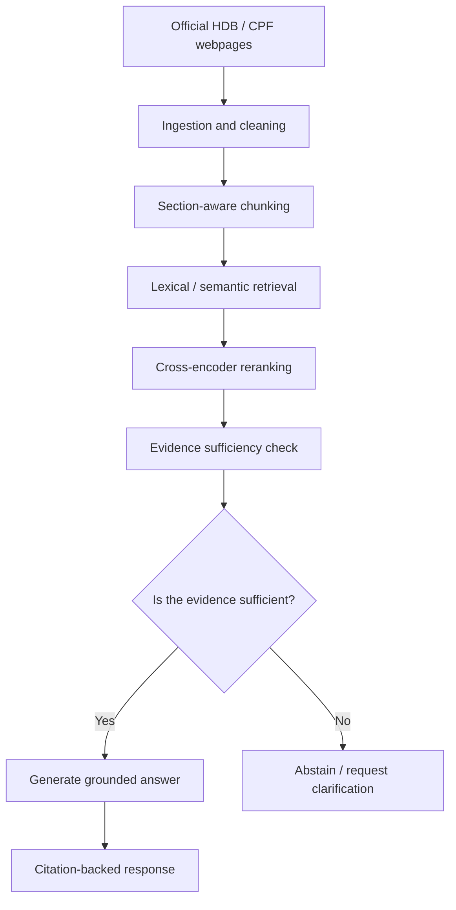

# trustrag-sg
TrustRAG-SG is a reliability-aware retrieval-augmented generation (RAG) prototype for answering questions over Singapore public-sector information, with an explicit focus on reducing unsupported answers.


The project investigates a specific failure mode of RAG systems: retrieving related information does not necessarily mean that the retrieved evidence is sufficient to support a definitive answer. Trust_RAG_HDB_CPF therefore introduces an evidence-aware abstention mechanism that can answer, provide a qualified answer, or abstain when the available evidence is insufficient.

The prototype focuses on publicly available HDB and CPF information relating to housing, grants, loans, CPF usage, retirement, and interest rates.


### 1. Problem Statement
Singapore citizens rely on official government information for consequential decisions involving housing and retirement. Although agencies such as HDB and CPF Board publish extensive guidance online, relevant information may be distributed across multiple pages and contain eligibility conditions, exceptions, and time-sensitive rules.

RAG systems can make this information easier to navigate by retrieving official sources before generating an answer. However, a key reliability issue remains: a system may retrieve information that is related to the question but still insufficient to support the exact answer requested.

This creates the risk of plausible but unsupported answers.

For example:
-a user may ask about a future CPF interest rate that has not been published;
-a user may provide only partial eligibility information;
-relevant evidence may span multiple HDB and CPF pages;
-an outdated source may be retrieved for a time-sensitive policy question.

In these cases, confidently generating an answer may be less desirable than explicitly stating that the available evidence is insufficient.

Hence we are answering this question: "Can an evidence-aware RAG system reduce unsupported answers on Singapore government policy questions while maintaining useful answer coverage?"


### 2. Objectives
The project has four main objectives:

1) Build a reproducible RAG pipeline over a curated corpus of official HDB and CPF webpages.
2) Compare multiple retrieval configurations, including lexical retrieval, semantic retrieval, and reranking.
3) Evaluate whether an evidence-aware abstention mechanism reduces unsupported answers.
4) Analyze the trade-off between answer coverage and reliability.


### 3. Target Users

The primary end users are citizens seeking authoritative information about HDB and CPF policies.

A secondary stakeholder group is public agencies exploring the deployment of RAG-based knowledge assistants. For this group, the prototype is also an evaluation framework for measuring whether a system can recognize when its knowledge base is insufficient to support an answer.


### 4. System Architecture

The system is organised into separate stages so retrieval and generation failures can be evaluated independently.

## System Architecture



**AI Integration**

AI is integrated into the core functionality.

The AI-related components include:

1) semantic document retrieval using embedding models;
2) cross-encoder reranking of candidate passages;
3) LLM-based grounded answer generation;
4) evidence-aware answer qualification / abstention;
5) structured evaluation of generated answers.

The generation model does not operate independently. It receives retrieved evidence and must generate answers that remain grounded in the supplied context.


### 5. Data Sources

The corpus consists of a manually curated set of publicly available webpages from:

- Housing & Development Board (HDB)
- Central Provident Fund Board (CPF Board)

The initial corpus contains 22 pages covering topics including:

- flat eligibility;
- housing grants;
- HDB housing loans;
- resale procedures;
- CPF usage for housing;
- CPF refunds on property sale;
- CPF retirement;
- CPF LIFE;
- CPF interest rates.

The corpus was intentionally kept relatively small and authoritative. The objective of this prototype is not to maximise document volume, but to investigate retrieval reliability and evidence sufficiency using a controlled set of official sources.

The complete source list and associated metadata are maintained in:

`source_manifest.json`

Each source is assigned a stable `source_id`, which allows retrieved chunks and evaluation questions to be traced back to their original source.


### 6. Data Collection and Ingestion

The ingestion pipeline was designed to support multiple acquisition methods because the HDB and CPF webpages did not behave consistently when retrieved programmatically.

#### CPF Pages

Most CPF webpages could be retrieved using Python's `requests` library.

One source, `CPF10`, relied on JavaScript-rendered content. A normal HTTP request did not provide the complete content required for ingestion. Playwright was therefore used to render the page in a browser environment before saving the resulting HTML.

The retrieval approach was therefore:

```text
Standard CPF pages
        ↓
Python requests
        ↓
Raw HTML

CPF10
        ↓
Playwright browser rendering
        ↓
Rendered HTML
```

#### HDB Pages

The HDB webpages could not be reliably retrieved using the Python `requests`-based ingestion method used in this prototype.

Rather than introducing increasingly complex scraping logic or attempting to bypass the website's delivery behaviour, the selected HDB pages were manually downloaded and stored as HTML files for ingestion.

The same downstream cleaning and chunking pipeline was then applied to these manually downloaded files.

```text
Selected HDB pages
        ↓
Manual HTML download
        ↓
Raw HTML

Selected CPF pages
        ↓
requests / Playwright
        ↓
Raw HTML

             ↓
     Common ingestion pipeline
             ↓
       Content cleaning
             ↓
    Section-aware extraction
             ↓
          Chunking
```

This hybrid approach was chosen to keep the prototype reproducible while avoiding unnecessary scraping complexity. The source URL and source identifier are retained regardless of the acquisition method.


### 7. Data Processing

After acquisition, HTML documents pass through a common processing pipeline.

The pipeline:

1. reads the raw HTML;
2. removes irrelevant page elements and boilerplate;
3. extracts the main textual content;
4. identifies sections using HTML heading structure;
5. splits large sections into overlapping chunks;
6. attaches source and section metadata;
7. writes the resulting records to JSONL.

Each generated chunk contains the text together with metadata such as:

```json
{
  "chunk_id": "HDB08:003:001",
  "text": "...",
  "metadata": {
    "source_id": "HDB08",
    "agency": "HDB",
    "title": "...",
    "url": "...",
    "heading_path": ["...", "..."],
    "section_index": 3,
    "part_index": 1
  }
}
```

The `heading_path` is retained because policy information is frequently organised into sections such as eligibility conditions, income ceilings, grant amounts, and exceptions. Preserving this structure helps maintain the context surrounding individual rules.

### 8. Chunking Strategy

The ingestion pipeline uses **section-aware chunking**.

Rather than splitting an entire webpage into arbitrary fixed-length windows, the HTML heading structure is first used to divide each page into logical sections. Sections that exceed the configured maximum length are then divided into overlapping chunks.

This approach was chosen because HDB and CPF pages frequently organise policy information under distinct headings such as eligibility conditions, income ceilings, grant amounts, and exceptions. Preventing chunks from crossing section boundaries helps preserve the local context of individual policy rules.

#### Chunk Size Selection

Chunk size and overlap were treated as experimental hyperparameters rather than fixed arbitrarily.

Three configurations were evaluated:

| Configuration | Maximum words | Overlap |
|---|---:|---:|
| A | 150 | 30 |
| B | 250 | 40 |
| C | 350 | 50 |

The chunking experiment was conducted in two stages.

**Stage 1 — TF-IDF lexical retrieval**

The three configurations were first evaluated using a TF-IDF lexical retriever. This provided a lightweight and deterministic baseline for examining how chunk size affected retrieval performance.

**Stage 2 — BGE semantic retrieval**

The same three chunking configurations were subsequently evaluated using `BAAI/bge-small-en-v1.5` semantic embeddings. This second experiment tested whether the preferred chunking configuration remained effective when retrieval was based on semantic similarity rather than lexical overlap.

Across each comparison, the following were held constant:

- source corpus;
- HTML extraction and cleaning pipeline;
- section-aware splitting logic;
- retrieval benchmark;
- evaluation metrics.

Only the chunk size and overlap were changed within each retrieval-method experiment.

Retrieval performance was evaluated using:

- Recall@1;
- Recall@3;
- Recall@5;
- Mean Reciprocal Rank (MRR).

For questions requiring multiple sources, Recall@K measures the proportion of annotated gold sources retrieved within the top K results. MRR measures the rank of the **first relevant source**, and therefore complements rather than replaces Recall@K for multi-source questions.

The results of these experiments are presented in the following section.


### 9. Retrieval Benchmark

An initial pool of 115 candidate evaluation questions was created across several question and failure-mode categories.

The pool was subsequently reduced to a 60-question benchmark through manual review. Redundant questions and questions that did not represent realistic user interactions were removed while retaining coverage across different reasoning and reliability scenarios.

The final benchmark contains:

| Category | Number of questions |
|---|---:|
| Direct answerable | 15 |
| Multi-hop | 10 |
| Conditional | 10 |
| Partially answerable | 10 |
| Unanswerable | 7 |
| Adversarial / misleading | 4 |
| Temporal | 4 |
| **Total** | **60** |

The benchmark serves two different evaluation purposes.

Questions for which supporting evidence exists in the corpus are used for retrieval evaluation. Questions deliberately requiring unavailable information are reserved for later evaluation of abstention and unsupported-answer behaviour.

For the initial retrieval experiment, **51 evidence-bearing questions** were selected.

Reference answers and expected supporting sources were AI-assisted during initial benchmark development but are manually reviewed against the corresponding authoritative source before being treated as validated reference labels.


### 10. Retrieval Evaluation Methodology

The first experiment evaluates retrieval independently from answer generation.

This separation is intentional. Evaluating retrieval before introducing the generation model makes it possible to distinguish:

- failure to retrieve the necessary evidence; from
- failure of the LLM to correctly use evidence that was successfully retrieved.

For each benchmark question, retrieved results are compared against the manually identified reference source or sources.

The following metrics are used:

#### Recall@1

Measures whether relevant evidence appears as the highest-ranked retrieval result.

#### Recall@3

Measures whether relevant evidence appears within the first three retrieved results.

#### Recall@5

Measures whether relevant evidence appears within the first five retrieved results.

#### Mean Reciprocal Rank (MRR)

Measures how highly the first relevant result is ranked.

A relevant source appearing at rank 1 receives a reciprocal rank of `1`, rank 2 receives `0.5`, rank 3 receives `0.333`, and so forth.

For questions requiring multiple sources, source coverage is also inspected because retrieving only one of multiple required sources may not provide sufficient evidence for downstream generation.

The initial chunking experiment uses source-level relevance. A limitation of this approach is that retrieving the correct source does not necessarily guarantee that the specific supporting chunk was retrieved. A stricter evidence-level evaluation is therefore considered as part of subsequent error analysis.

### 11. Chunking Experiment Results

#### 11.1 TF-IDF Chunking Ablation

The initial experiment evaluated the three chunking configurations using TF-IDF lexical retrieval.

| Chunking | Recall@1 | Recall@3 | Recall@5 | MRR |
|---|---:|---:|---:|---:|
| 150 / 30 | 0.370 | **0.641** | 0.684 | 0.640 |
| 250 / 40 | 0.402 | 0.602 | 0.746 | 0.669 |
| **350 / 50** | **0.441** | 0.632 | **0.805** | **0.703** |

The 350/50 configuration achieved the highest Recall@1, Recall@5, and MRR under lexical retrieval.

#### 11.2 BGE Semantic Chunking Ablation

The experiment was repeated using `BAAI/bge-small-en-v1.5` semantic embeddings.

| Chunking | Recall@1 | Recall@3 | Recall@5 | MRR |
|---|---:|---:|---:|---:|
| 150 / 30 | 0.478 | 0.636 | 0.699 | 0.745 |
| 250 / 40 | 0.524 | **0.744** | **0.809** | 0.787 |
| **350 / 50** | **0.553** | 0.734 | 0.803 | **0.802** |

The semantic retrieval experiment showed a trade-off between the 250/40 and 350/50 configurations. The 250/40 configuration achieved marginally higher Recall@3 and Recall@5, while 350/50 achieved the highest Recall@1 and MRR.

The 350/50 configuration was selected for subsequent experiments because it ranked the first relevant source more highly on average while sacrificing only a small amount of Recall@5 (`0.809` to `0.803`). This is useful for downstream RAG, where highly ranked evidence is more likely to influence reranking and answer generation.

The agreement between the TF-IDF and BGE experiments also provided additional evidence that 350/50 was a reasonable configuration for this corpus.

Accordingly, subsequent retrieval experiments use:

- **Maximum chunk size:** 350 words
- **Overlap:** 50 words

### 12. Retrieval Error Analysis

Although the selected 350/50 configuration performed strongly relative to the other tested chunking configurations, retrieval remained imperfect. Under BGE semantic retrieval, it achieved a Recall@5 of 0.803, indicating that some annotated gold sources were still not retrieved within the top five results.

The remaining errors were therefore examined to determine whether further chunk-size tuning was justified or whether the failures were more likely to arise from the retrieval method itself.

#### 12.1 Complete Retrieval Misses

For some questions, the expected source was absent from the top retrieved results.

Several of these failures persisted across multiple chunking configurations, suggesting that chunk size alone was not responsible. Possible explanations include:

- differences between the terminology used in the question and the source;
- semantic similarity with competing but non-gold sources;
- relevant evidence being ranked outside the top-k results; or
- incomplete gold-source annotations where another authoritative page may also contain sufficient evidence.

Persistent misses are manually reviewed before being attributed to retrieval failure, particularly where multiple official pages contain overlapping policy information.

#### 12.2 Multi-Source Coverage

Some benchmark questions require evidence from more than one source.

For these questions, retrieving one relevant source does not necessarily provide sufficient evidence to answer the entire question.

For example:

```text
Gold sources:
Source A
Source B

Retrieved top 5:
Source A
Source C
Source D
Source A
Source E
```

The retrieval is partially successful because one relevant source is present, but gold-source coverage is only:

```text
1 / 2 = 0.5
```

This is why Recall@K and MRR are interpreted together. MRR measures how early the **first relevant source** appears, whereas Recall@K measures how much of the annotated source set is recovered within the top K results.

This distinction is particularly important for multi-hop questions.

#### 12.3 Duplicate-Source Crowding

Inspection of the retrieved results also showed cases where multiple chunks from the same source occupied several positions in the top-k results.

For example:

```text
Rank 1 → Source A, chunk 3
Rank 2 → Source A, chunk 4
Rank 3 → Source A, chunk 2
Rank 4 → Source A, chunk 5
Rank 5 → Source B, chunk 1
```

Although the individual chunks may be relevant, repeated retrieval from the same source reduces the diversity of evidence available to downstream components. This may be particularly limiting for multi-hop questions that require information from multiple documents.

Source diversification is therefore retained as a possible later-stage improvement, but is not introduced during the primary retrieval comparison so that the effect of each retrieval component can be evaluated independently.

#### 12.4 Source-Level Evaluation Limitation

The current retrieval benchmark evaluates relevance primarily at the source level.

A retrieved chunk is treated as relevant when its `source_id` matches an annotated gold source. However, retrieving the correct webpage does not necessarily mean that the retrieved chunk contains the specific evidence needed to answer the question.

For example:

```text
Correct source retrieved
        ↓
Wrong section of source retrieved
        ↓
Source-level metric = relevant
        ↓
Evidence may still be insufficient
```

This means the reported retrieval metrics may overestimate true evidence retrieval in some cases.

To address this limitation, manually validated evidence passages are retained for subsequent evidence-sufficiency and end-to-end evaluation. The source-level benchmark is used primarily to compare retrieval configurations consistently rather than as a complete measure of answer correctness.

### 13. Final Chunking Selection

Based on the lexical and semantic chunking experiments, the following configuration was selected for subsequent experiments:

```text
Maximum chunk size: 350 words
Chunk overlap:       50 words
```

The decision was based on the overall ranking trade-off rather than a single metric. Under BGE semantic retrieval, 350/50 achieved the highest Recall@1 and MRR, while its Recall@5 (`0.803`) was only marginally below the best-performing 250/40 configuration (`0.809`).

The 350/50 configuration was therefore fixed for the remaining retrieval experiments. Holding the corpus segmentation constant allows changes in retrieval performance to be attributed to the retrieval method rather than differences in chunking.

With the chunking strategy fixed, the next experiment evaluates whether semantic retrieval and reranking improve upon the lexical retrieval baseline.

### 14. Retrieval Method Comparison

Three retrieval approaches were evaluated using the fixed 350/50 corpus and the same 51-question evidence-bearing benchmark:

1. **TF-IDF** — a lexical retrieval baseline based on term and bigram overlap.
2. **BGE** — semantic retrieval using `BAAI/bge-small-en-v1.5` embeddings.
3. **BGE + cross-encoder reranker** — BGE first retrieves a larger candidate set, which is then rescored and reordered using a cross-encoder.

The comparison was designed as a controlled retrieval ablation:

```text
TF-IDF
Lexical baseline
        │
        ▼
BGE embeddings
Semantic retrieval
        │
        ▼
BGE + cross-encoder
Semantic retrieval + reranking
```

Across all three approaches, the following were held constant:

- source corpus;
- 350/50 chunking configuration;
- 51 evaluation questions;
- gold-source annotations; and
- evaluation metrics.

This isolates the effect of the retrieval method and the additional reranking stage.

#### 14.1 Overall Results

| Retrieval Method | Recall@1 | Recall@3 | Recall@5 | MRR |
|---|---:|---:|---:|---:|
| TF-IDF | 0.441 | 0.632 | **0.805** | 0.703 |
| **BGE** | **0.553** | **0.734** | 0.803 | **0.802** |
| BGE + reranker | 0.530 | 0.694 | 0.737 | 0.787 |

BGE semantic retrieval provided the strongest overall ranking performance.

Compared with TF-IDF, BGE improved:

- Recall@1 from `0.441` to `0.553`;
- Recall@3 from `0.632` to `0.734`; and
- MRR from `0.703` to `0.802`.

TF-IDF achieved a marginally higher Recall@5 (`0.805` versus `0.803`). However, BGE consistently placed relevant sources higher in the ranking, as reflected by its stronger Recall@1, Recall@3, and MRR.

For a downstream RAG pipeline, this ranking behaviour is valuable because the highest-ranked passages are more likely to influence evidence assessment and answer generation.

BGE was therefore selected as the primary retrieval method.


#### 14.2 Effect of Cross-Encoder Reranking

Adding the cross-encoder reranker did not improve aggregate retrieval performance.

Relative to plain BGE:

| Metric | BGE | BGE + Reranker |
|---|---:|---:|
| Recall@1 | **0.553** | 0.530 |
| Recall@3 | **0.734** | 0.694 |
| Recall@5 | **0.803** | 0.737 |
| MRR | **0.802** | 0.787 |

The reranker improved some individual categories and questions, but these gains did not translate into stronger overall performance. In particular, Recall@5 decreased from `0.803` to `0.737`.

The result demonstrates that adding a more complex retrieval component does not necessarily improve performance on the target domain.

Rather than retaining the reranker based on architectural complexity alone, the simpler BGE retriever was selected based on measured benchmark performance.

This also reduces inference latency and compute requirements because the final retrieval pipeline does not require an additional cross-encoder pass over candidate passages.


### 15. Why Relevant Evidence Is Still Missed

Although BGE achieved the strongest overall ranking performance, its Recall@5 remained `0.803`.

To understand the remaining failures, retrieval was also evaluated over a larger top-20 candidate set.

For BGE, candidate Recall@20 reached approximately:

```text
0.967
```

This is substantially higher than its Recall@5 of `0.803`.

This suggests that many relevant sources are successfully identified by semantic retrieval but are ranked outside the final top-five evidence set.

Error analysis of the BGE results identified:

| Error Type | Count |
|---|---:|
| Successful retrieval | 36 |
| Duplicate-source crowding | 8 |
| Ranking miss | 4 |
| Partial or potentially incomplete gold annotation | 3 |
| Candidate retrieval miss | 0 |

A notable failure mode was **duplicate-source crowding**.

Multiple chunks from the same highly relevant document can occupy several positions in the top-five results:

```text
Rank 1 → Source A, chunk 2
Rank 2 → Source A, chunk 5
Rank 3 → Source A, chunk 1
Rank 4 → Source B, chunk 3
Rank 5 → Source A, chunk 4
```

This behaviour is not necessarily incorrect: multiple chunks from the same source may all be relevant.

However, it can reduce evidence coverage for multi-hop questions where the complete answer requires information from more than one source.

The combination of high candidate Recall@20 and observed duplicate-source crowding motivates a targeted source-diversification experiment.


### 16. Source Diversification Experiment

Rather than adding source diversification directly to the retrieval pipeline, it is evaluated as a separate intervention.

The purpose of diversification is not to identify new candidate evidence. Instead, it tests whether the final evidence set benefits from limiting the number of highly similar chunks originating from the same source.

The experiment therefore compares:

```text
BGE retrieval
      ↓
Top-20 candidates
      ↓
Standard ranking
      ↓
Top 5
```

against:

```text
BGE retrieval
      ↓
Top-20 candidates
      ↓
Source-aware diversification
      ↓
Top 5
```

The primary metrics remain:

- Recall@1;
- Recall@3;
- Recall@5;
- MRR.

Particular attention is also given to:

- multi-hop Recall@K;
- number of unique sources in the final evidence set;
- duplicate fraction; and
- source coverage for questions requiring multiple gold sources.

This experiment is motivated directly by observed retrieval errors rather than introducing diversification as an assumed improvement.


### 15. Source Diversification with Maximal Marginal Relevance

Error analysis of the BGE retriever showed that relevant sources were frequently present within the broader candidate set but did not always appear in the final top-five results.

BGE achieved a candidate Recall@20 of approximately `0.967`, compared with a Recall@5 of `0.803`. Inspection of individual retrieval results also identified cases where multiple highly similar chunks from the same source occupied several of the top-five positions.

This motivated an experiment using **Maximal Marginal Relevance (MMR)** to construct a less redundant final evidence set.

MMR balances two objectives:

1. relevance of a candidate chunk to the user question; and
2. similarity of that candidate to chunks that have already been selected.

Conceptually:

```text
BGE retrieval
      ↓
Top-20 candidates ranked by semantic similarity
      ↓
MMR selection
      ↓
Balance query relevance and evidence redundancy
      ↓
Final top 5 evidence chunks
```

The MMR objective can be expressed as:

\[
\text{MMR}(d) =
\lambda \cdot \text{sim}(q,d)
-
(1-\lambda) \cdot
\max_{s \in S}\text{sim}(d,s)
\]

where:

- \(q\) is the question;
- \(d\) is a candidate chunk;
- \(S\) is the set of chunks already selected;
- \(\lambda\) controls the trade-off between relevance and diversity.

A higher λ places greater weight on relevance, while a lower λ applies a stronger diversity penalty.


#### 15.1 MMR Lambda Selection

Rather than selecting λ arbitrarily, five values were evaluated using the same 51-question retrieval benchmark.

| Selection Method | Recall@1 | Recall@3 | Recall@5 | MRR |
|---|---:|---:|---:|---:|
| BGE similarity Top-5 | 0.553 | 0.734 | 0.803 | 0.802 |
| MMR λ=0.5 | 0.553 | 0.648 | 0.786 | 0.774 |
| MMR λ=0.6 | 0.553 | 0.707 | 0.799 | 0.780 |
| MMR λ=0.7 | 0.553 | 0.708 | 0.829 | 0.793 |
| MMR λ=0.8 | 0.553 | 0.744 | 0.835 | 0.799 |
| **MMR λ=0.9** | **0.553** | **0.760** | **0.875** | **0.809** |

The results show that aggressive diversification was not beneficial. At λ values of 0.5 and 0.6, the diversity penalty reduced retrieval performance relative to the original BGE ranking.

Performance improved as greater weight was placed on query relevance. **λ=0.9 achieved the strongest overall results**, increasing Recall@3 from `0.734` to `0.760` and Recall@5 from `0.803` to `0.875`, while also slightly improving MRR from `0.802` to `0.809`.

Recall@1 remained unchanged at `0.553` because the highest-ranked BGE candidate is selected first before the redundancy penalty affects subsequent selections.


#### 15.2 Effect on Evidence Diversity

MMR also changed the composition of the final top-five evidence set.

| Selection Method | Unique Sources@5 | Duplicate Fraction@5 | Maximum Source Share@5 |
|---|---:|---:|---:|
| BGE similarity Top-5 | 3.27 | 0.345 | 0.498 |
| MMR λ=0.9 | **3.51** | **0.298** | **0.463** |

MMR λ=0.9 therefore increased the average number of unique sources represented in the final evidence set while reducing duplicate-source concentration.

The result suggests that a relatively small diversity penalty was sufficient for this corpus. Stronger diversification could discard highly relevant chunks merely because they were semantically similar, whereas λ=0.9 retained relevance as the dominant selection criterion while reducing some redundant evidence.


#### 15.3 Final Retrieval Configuration

Based on the retrieval experiments, the selected retrieval pipeline is:

```text
User question
      ↓
BGE-small-en-v1.5 query embedding
      ↓
Semantic retrieval
      ↓
Top-20 candidate chunks
      ↓
MMR selection (λ = 0.9)
      ↓
Final top-5 evidence chunks
```

The cross-encoder reranker was not retained because it reduced aggregate retrieval performance, while MMR diversification improved Recall@5 without requiring an additional scoring model.

This results in a relatively lightweight retrieval architecture in which BGE provides semantic candidate retrieval and MMR performs diversity-aware evidence selection.
