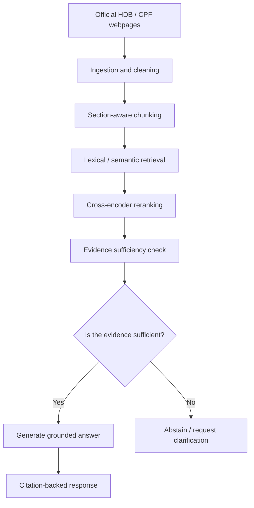

# trustrag-sg
TrustRAG-SG is a reliability-aware retrieval-augmented generation (RAG) prototype for answering questions over Singapore public-sector information, with an explicit focus on reducing unsupported answers.

The project investigates a specific failure mode of RAG systems: retrieving related information does not necessarily mean that the retrieved evidence is sufficient to support a definitive answer. Trust_RAG_HDB_CPF therefore introduces an evidence-aware abstention mechanism that can answer, provide a qualified answer, or abstain when the available evidence is insufficient.

The prototype focuses on publicly available HDB and CPF information relating to housing, grants, loans, CPF usage, retirement, and interest rates.

### 1. Problem Statement
Singapore citizens rely on official government information for consequential decisions involving housing and retirement. Although agencies such as HDB and CPF Board publish extensive guidance online, relevant information may be distributed across multiple pages and contain eligibility conditions, exceptions, and time-sensitive rules.

RAG systems can make this information easier to navigate by retrieving official sources before generating an answer. However, a key reliability issue remains: a system may retrieve information that is related to the question but still insufficient to support the exact answer requested.

This creates the risk of plausible but unsupported answers.

For example:
-a user may ask about a future CPF interest rate that has not been published;
-a user may provide only partial eligibility information;
-relevant evidence may span multiple HDB and CPF pages;
-an outdated source may be retrieved for a time-sensitive policy question.

In these cases, confidently generating an answer may be less desirable than explicitly stating that the available evidence is insufficient.

Hence we are answering this question: "Can an evidence-aware RAG system reduce unsupported answers on Singapore government policy questions while maintaining useful answer coverage?"

### 2. Objectives
The project has four main objectives:

1) Build a reproducible RAG pipeline over a curated corpus of official HDB and CPF webpages.
2) Compare multiple retrieval configurations, including lexical retrieval, semantic retrieval, and reranking.
3) Evaluate whether an evidence-aware abstention mechanism reduces unsupported answers.
4) Analyze the trade-off between answer coverage and reliability.

### 3. Target Users

The primary end users are citizens seeking authoritative information about HDB and CPF policies.

A secondary stakeholder group is public agencies exploring the deployment of RAG-based knowledge assistants. For this group, the prototype is also an evaluation framework for measuring whether a system can recognize when its knowledge base is insufficient to support an answer.

### 4. System Architecture

The system is organised into separate stages so retrieval and generation failures can be evaluated independently.

## System Architecture

**AI Integration**

AI is integrated into the core functionality.

The AI-related components include:

1) semantic document retrieval using embedding models;
2) cross-encoder reranking of candidate passages;
3) LLM-based grounded answer generation;
4) evidence-aware answer qualification / abstention;
5) structured evaluation of generated answers.

The generation model does not operate independently. It receives retrieved evidence and must generate answers that remain grounded in the supplied context.

### 5. Data Sources

The corpus consists of manually curated public webpages from:

Housing & Development Board (HDB)
Central Provident Fund Board (CPF Board)

The initial corpus contains 22 pages covering:

flat eligibility;
housing grants;
HDB housing loans;
resale procedures;
CPF usage for housing;
CPF refunds on property sale;
CPF retirement;
CPF LIFE;
CPF interest rates.

