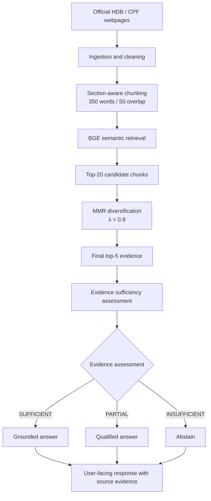

# trustrag-sg
The project investigates a specific failure mode of RAG systems:retrieving related information does not necessarily mean that the retrieved evidence is sufficient to support a definitive answer.

TrustRAG-SG therefore introduces an explicit evidence-sufficiency assessment
before answer generation. Based on the retrieved evidence, the system can
provide a grounded answer, provide a qualified answer when only part of the
question is supported, or abstain when the available evidence is insufficient.

The prototype focuses on publicly available HDB and CPF information relating
to housing, grants, loans, CPF usage, retirement, and interest rates.

> **Disclaimer:** TrustRAG-SG is a research prototype, not an HDB/CPF
> eligibility determination or financial advice. Users should verify
> consequential decisions against the linked official agency sources.

### 1. Problem Statement
Singapore citizens rely on official government information for consequential decisions involving housing and retirement. Although agencies such as HDB and CPF Board publish extensive guidance online, relevant information may be distributed across multiple pages and contain eligibility conditions, exceptions, and time-sensitive rules.

RAG systems can make this information easier to navigate by retrieving official sources before generating an answer. However, a key reliability issue remains: a system may retrieve information that is related to the question but still insufficient to support the exact answer requested.

This creates the risk of plausible but unsupported answers.

For example:
-a user may ask about a future CPF interest rate that has not been published;
-a user may provide only partial eligibility information;
-relevant evidence may span multiple HDB and CPF pages;
-an outdated source may be retrieved for a time-sensitive policy question.

In these cases, confidently generating an answer may be less desirable than explicitly stating that the available evidence is insufficient.

Hence we are answering this question: "Can an evidence-aware RAG system reduce unsupported answers on Singapore government policy questions while maintaining useful answer coverage?"


### 2. Objectives
The project has four main objectives:

1) Build a reproducible RAG pipeline over a curated corpus of official HDB and CPF webpages.
2) Compare multiple retrieval configurations, including lexical retrieval, semantic retrieval, and reranking.
3) Evaluate whether an explicit evidence-sufficiency mechanism can reduce unsupported answers while preserving useful answer coverage.
4) Analyze the trade-off between answer coverage and reliability.


### 3. Target Users

The primary end users are citizens seeking authoritative information about HDB and CPF policies.

A secondary stakeholder group is public agencies exploring the deployment of RAG-based knowledge assistants. For this group, the prototype is also an evaluation framework for measuring whether a system can recognize when its knowledge base is insufficient to support an answer.

### 4. System Architecture

TrustRAG-SG separates retrieval, evidence assessment, and response generation into distinct stages. This modular design allows retrieval quality and evidence-sufficiency decisions to be evaluated independently from final answer generation.

The final pipeline uses the retrieval configuration selected through the experiments described in later sections: section-aware 350/50 chunking, BGE semantic retrieval, and MMR diversification with λ = 0.9.



The retrieval stage first identifies the 20 most semantically relevant chunks using `BAAI/bge-small-en-v1.5`. Maximal Marginal Relevance (MMR) is then applied to select five final evidence chunks while balancing query relevance and redundancy.

The retrieved evidence is subsequently assessed for:

- **support** — whether it directly supports the requested claim;
- **completeness** — whether all material parts of the question are covered;
- **conditions** — whether required assumptions, eligibility conditions, or user-specific information are missing; and
- **temporal validity** — whether the evidence applies to the requested time period.

The evidence is classified as `SUFFICIENT`, `PARTIAL`, or `INSUFFICIENT`. This classification determines whether TrustRAG provides a grounded answer, provides only the supported portion with an explicit limitation, or abstains.

#### 4.1 Baseline RAG vs TrustRAG

To isolate the effect of the evidence-sufficiency mechanism, the baseline RAG and TrustRAG use the same retrieval pipeline and receive the same final top-five evidence.

**Baseline RAG**

```text
Question
   ↓
BGE retrieval
   ↓
Top-20 candidates
   ↓
MMR (λ = 0.9)
   ↓
Top-5 evidence
   ↓
Gemini grounded generation
   ↓
Response
```

**TrustRAG**

```text
Question
   ↓
BGE retrieval
   ↓
Top-20 candidates
   ↓
MMR (λ = 0.9)
   ↓
Top-5 evidence
   ↓
Gemini evidence-sufficiency assessment
   ↓
SUFFICIENT / PARTIAL / INSUFFICIENT
   ↓
Grounded answer / qualified answer / abstention
```

The key experimental difference is therefore the explicit evidence-sufficiency stage. The baseline relies on the generation model's grounding instructions to decide how to respond, whereas TrustRAG makes evidence sufficiency an explicit and observable intermediate decision.

#### 4.2 AI Integration

AI is integrated into the core retrieval and response pipeline rather than being used only as a final API call.

The main AI components are:

1. **Semantic retrieval** — BGE embeddings (`BAAI/bge-small-en-v1.5`) represent questions and document chunks for semantic similarity search.
2. **Evidence-sufficiency assessment** — Gemini evaluates whether the retrieved evidence is sufficient, partial, or insufficient with respect to the user's exact question.
3. **Grounded response generation** — Gemini generates responses using only the retrieved evidence and the evidence-sufficiency decision.

MMR diversification is applied between semantic retrieval and generation. MMR is not itself an AI model; it is a retrieval-selection algorithm used to balance relevance and redundancy in the final evidence set.

The generation model therefore does not operate directly on the full corpus. It receives a small retrieved evidence set and is constrained to generate responses grounded in that evidence.
### 5. Data Sources

The corpus consists of a manually curated set of publicly available webpages from:

- Housing & Development Board (HDB)
- Central Provident Fund Board (CPF Board)

The initial corpus contains 22 pages covering topics including:

- flat eligibility;
- housing grants;
- HDB housing loans;
- resale procedures;
- CPF usage for housing;
- CPF refunds on property sale;
- CPF retirement;
- CPF LIFE;
- CPF interest rates.

The corpus was intentionally kept relatively small and authoritative. The objective of this prototype is not to maximise document volume, but to investigate retrieval reliability and evidence sufficiency using a controlled set of official sources.

The complete source list and associated metadata are maintained in:

`source_manifest.json`

Each source is assigned a stable `source_id`, which allows retrieved chunks and evaluation questions to be traced back to their original source.


### 6. Data Collection and Ingestion

The ingestion pipeline was designed to support multiple acquisition methods because the HDB and CPF webpages did not behave consistently when retrieved programmatically.

#### CPF Pages

Most CPF webpages could be retrieved using Python's `requests` library.

One source, `CPF10`, relied on JavaScript-rendered content. A normal HTTP request did not provide the complete content required for ingestion. Playwright was therefore used to render the page in a browser environment before saving the resulting HTML.

The retrieval approach was therefore:

```text
Standard CPF pages
        ↓
Python requests
        ↓
Raw HTML

CPF10
        ↓
Playwright browser rendering
        ↓
Rendered HTML
```

#### HDB Pages

The HDB webpages could not be reliably retrieved using the Python `requests`-based ingestion method used in this prototype.

Rather than introducing increasingly complex scraping logic or attempting to bypass the website's delivery behaviour, the selected HDB pages were manually downloaded and stored as HTML files for ingestion.

The same downstream cleaning and chunking pipeline was then applied to these manually downloaded files.

```text
Selected HDB pages
        ↓
Manual HTML download
        ↓
Raw HTML

Selected CPF pages
        ↓
requests / Playwright
        ↓
Raw HTML

             ↓
     Common ingestion pipeline
             ↓
       Content cleaning
             ↓
    Section-aware extraction
             ↓
          Chunking
```

This hybrid approach was chosen to keep the prototype reproducible while avoiding unnecessary scraping complexity. The source URL and source identifier are retained regardless of the acquisition method.


### 7. Data Processing

After acquisition, HTML documents pass through a common processing pipeline.

The pipeline:

1. reads the raw HTML;
2. removes irrelevant page elements and boilerplate;
3. extracts the main textual content;
4. identifies sections using HTML heading structure;
5. splits large sections into overlapping chunks;
6. attaches source and section metadata;
7. writes the resulting records to JSONL.

Each generated chunk contains the text together with metadata such as:

```json
{
  "chunk_id": "HDB08:003:001",
  "text": "...",
  "metadata": {
    "source_id": "HDB08",
    "agency": "HDB",
    "title": "...",
    "url": "...",
    "heading_path": ["...", "..."],
    "section_index": 3,
    "part_index": 1
  }
}
```

The `heading_path` is retained because policy information is frequently organised into sections such as eligibility conditions, income ceilings, grant amounts, and exceptions. Preserving this structure helps maintain the context surrounding individual rules.

### 8. Chunking Strategy

The ingestion pipeline uses **section-aware chunking**.

Rather than splitting an entire webpage into arbitrary fixed-length windows, the HTML heading structure is first used to divide each page into logical sections. Sections that exceed the configured maximum length are then divided into overlapping chunks.

This approach was chosen because HDB and CPF pages frequently organise policy information under distinct headings such as eligibility conditions, income ceilings, grant amounts, and exceptions. Preventing chunks from crossing section boundaries helps preserve the local context of individual policy rules.

#### Chunk Size Selection

Chunk size and overlap were treated as experimental hyperparameters rather than fixed arbitrarily.

Three configurations were evaluated:

| Configuration | Maximum words | Overlap |
|---|---:|---:|
| A | 150 | 30 |
| B | 250 | 40 |
| C | 350 | 50 |

The chunking experiment was conducted in two stages.

**Stage 1 — TF-IDF lexical retrieval**

The three configurations were first evaluated using a TF-IDF lexical retriever. This provided a lightweight and deterministic baseline for examining how chunk size affected retrieval performance.

**Stage 2 — BGE semantic retrieval**

The same three chunking configurations were subsequently evaluated using `BAAI/bge-small-en-v1.5` semantic embeddings. This second experiment tested whether the preferred chunking configuration remained effective when retrieval was based on semantic similarity rather than lexical overlap.

Across each comparison, the following were held constant:

- source corpus;
- HTML extraction and cleaning pipeline;
- section-aware splitting logic;
- retrieval benchmark;
- evaluation metrics.

Only the chunk size and overlap were changed within each retrieval-method experiment.

Retrieval performance was evaluated using:

- Recall@1;
- Recall@3;
- Recall@5;
- Mean Reciprocal Rank (MRR).

For questions requiring multiple sources, Recall@K measures the proportion of annotated gold sources retrieved within the top K results. MRR measures the rank of the **first relevant source**, and therefore complements rather than replaces Recall@K for multi-source questions.

The results of these experiments are presented in the following section.


### 9. Retrieval Benchmark

An initial pool of 115 candidate evaluation questions was created across several question and failure-mode categories.

The pool was subsequently reduced to a 60-question benchmark through manual review. Redundant questions and questions that did not represent realistic user interactions were removed while retaining coverage across different reasoning and reliability scenarios.

The final benchmark contains:

| Category | Number of questions |
|---|---:|
| Direct answerable | 15 |
| Multi-hop | 10 |
| Conditional | 10 |
| Partially answerable | 10 |
| Unanswerable | 7 |
| Adversarial / misleading | 4 |
| Temporal | 4 |
| **Total** | **60** |

The benchmark serves two different evaluation purposes.

Questions for which supporting evidence exists in the corpus are used for retrieval evaluation. Questions deliberately requiring unavailable information are reserved for later evaluation of abstention and unsupported-answer behaviour.

For the initial retrieval experiment, **51 evidence-bearing questions** were selected.

Reference answers and expected supporting sources were AI-assisted during initial benchmark development but are manually reviewed against the corresponding authoritative source before being treated as validated reference labels.


### 10. Retrieval Evaluation Methodology

The first experiment evaluates retrieval independently from answer generation.

This separation is intentional. Evaluating retrieval before introducing the generation model makes it possible to distinguish:

- failure to retrieve the necessary evidence; from
- failure of the LLM to correctly use evidence that was successfully retrieved.

For each benchmark question, retrieved results are compared against the manually identified reference source or sources.

The following metrics are used:

#### Recall@1

Measures whether relevant evidence appears as the highest-ranked retrieval result.

#### Recall@3

Measures whether relevant evidence appears within the first three retrieved results.

#### Recall@5

Measures whether relevant evidence appears within the first five retrieved results.

#### Mean Reciprocal Rank (MRR)

Measures how highly the first relevant result is ranked.

A relevant source appearing at rank 1 receives a reciprocal rank of `1`, rank 2 receives `0.5`, rank 3 receives `0.333`, and so forth.

For questions requiring multiple sources, source coverage is also inspected because retrieving only one of multiple required sources may not provide sufficient evidence for downstream generation.

The initial chunking experiment uses source-level relevance. A limitation of this approach is that retrieving the correct source does not necessarily guarantee that the specific supporting chunk was retrieved. A stricter evidence-level evaluation is therefore considered as part of subsequent error analysis.

### 11. Chunking Experiment Results

#### 11.1 TF-IDF Chunking Ablation

The initial experiment evaluated the three chunking configurations using TF-IDF lexical retrieval.

| Chunking | Recall@1 | Recall@3 | Recall@5 | MRR |
|---|---:|---:|---:|---:|
| 150 / 30 | 0.370 | **0.641** | 0.684 | 0.640 |
| 250 / 40 | 0.402 | 0.602 | 0.746 | 0.669 |
| **350 / 50** | **0.441** | 0.632 | **0.805** | **0.703** |

The 350/50 configuration achieved the highest Recall@1, Recall@5, and MRR under lexical retrieval.

#### 11.2 BGE Semantic Chunking Ablation

The experiment was repeated using `BAAI/bge-small-en-v1.5` semantic embeddings.

| Chunking | Recall@1 | Recall@3 | Recall@5 | MRR |
|---|---:|---:|---:|---:|
| 150 / 30 | 0.478 | 0.636 | 0.699 | 0.745 |
| 250 / 40 | 0.524 | **0.744** | **0.809** | 0.787 |
| **350 / 50** | **0.553** | 0.734 | 0.803 | **0.802** |

The semantic retrieval experiment showed a trade-off between the 250/40 and 350/50 configurations. The 250/40 configuration achieved marginally higher Recall@3 and Recall@5, while 350/50 achieved the highest Recall@1 and MRR.

The 350/50 configuration was selected for subsequent experiments because it ranked the first relevant source more highly on average while sacrificing only a small amount of Recall@5 (`0.809` to `0.803`). This is useful for downstream RAG, where highly ranked evidence is more likely to influence reranking and answer generation.

The agreement between the TF-IDF and BGE experiments also provided additional evidence that 350/50 was a reasonable configuration for this corpus.

Accordingly, subsequent retrieval experiments use:

- **Maximum chunk size:** 350 words
- **Overlap:** 50 words

### 12. Retrieval Error Analysis

Although the selected 350/50 configuration performed strongly relative to the other tested chunking configurations, retrieval remained imperfect. Under BGE semantic retrieval, it achieved a Recall@5 of 0.803, indicating that some annotated gold sources were still not retrieved within the top five results.

The remaining errors were therefore examined to determine whether further chunk-size tuning was justified or whether the failures were more likely to arise from the retrieval method itself.

#### 12.1 Complete Retrieval Misses

For some questions, the expected source was absent from the top retrieved results.

Several of these failures persisted across multiple chunking configurations, suggesting that chunk size alone was not responsible. Possible explanations include:

- differences between the terminology used in the question and the source;
- semantic similarity with competing but non-gold sources;
- relevant evidence being ranked outside the top-k results; or
- incomplete gold-source annotations where another authoritative page may also contain sufficient evidence.

Persistent misses are manually reviewed before being attributed to retrieval failure, particularly where multiple official pages contain overlapping policy information.

#### 12.2 Multi-Source Coverage

Some benchmark questions require evidence from more than one source.

For these questions, retrieving one relevant source does not necessarily provide sufficient evidence to answer the entire question.

For example:

```text
Gold sources:
Source A
Source B

Retrieved top 5:
Source A
Source C
Source D
Source A
Source E
```

The retrieval is partially successful because one relevant source is present, but gold-source coverage is only:

```text
1 / 2 = 0.5
```

This is why Recall@K and MRR are interpreted together. MRR measures how early the **first relevant source** appears, whereas Recall@K measures how much of the annotated source set is recovered within the top K results.

This distinction is particularly important for multi-hop questions.

#### 12.3 Duplicate-Source Crowding

Inspection of the retrieved results also showed cases where multiple chunks from the same source occupied several positions in the top-k results.

For example:

```text
Rank 1 → Source A, chunk 3
Rank 2 → Source A, chunk 4
Rank 3 → Source A, chunk 2
Rank 4 → Source A, chunk 5
Rank 5 → Source B, chunk 1
```

Although the individual chunks may be relevant, repeated retrieval from the same source reduces the diversity of evidence available to downstream components. This may be particularly limiting for multi-hop questions that require information from multiple documents.

Source diversification is therefore retained as a possible later-stage improvement, but is not introduced during the primary retrieval comparison so that the effect of each retrieval component can be evaluated independently.

#### 12.4 Source-Level Evaluation Limitation

The current retrieval benchmark evaluates relevance primarily at the source level.

A retrieved chunk is treated as relevant when its `source_id` matches an annotated gold source. However, retrieving the correct webpage does not necessarily mean that the retrieved chunk contains the specific evidence needed to answer the question.

For example:

```text
Correct source retrieved
        ↓
Wrong section of source retrieved
        ↓
Source-level metric = relevant
        ↓
Evidence may still be insufficient
```

This means the reported retrieval metrics may overestimate true evidence retrieval in some cases.

To address this limitation, manually validated evidence passages are retained for subsequent evidence-sufficiency and end-to-end evaluation. The source-level benchmark is used primarily to compare retrieval configurations consistently rather than as a complete measure of answer correctness.

### 13. Final Chunking Selection

Based on the lexical and semantic chunking experiments, the following configuration was selected for subsequent experiments:

```text
Maximum chunk size: 350 words
Chunk overlap:       50 words
```

The decision was based on the overall ranking trade-off rather than a single metric. Under BGE semantic retrieval, 350/50 achieved the highest Recall@1 and MRR, while its Recall@5 (`0.803`) was only marginally below the best-performing 250/40 configuration (`0.809`).

The 350/50 configuration was therefore fixed for the remaining retrieval experiments. Holding the corpus segmentation constant allows changes in retrieval performance to be attributed to the retrieval method rather than differences in chunking.

With the chunking strategy fixed, the next experiment evaluates whether semantic retrieval and reranking improve upon the lexical retrieval baseline.

### 14. Retrieval Method Comparison

Three retrieval approaches were evaluated using the fixed 350/50 corpus and the same 51-question evidence-bearing benchmark:

1. **TF-IDF** — a lexical retrieval baseline based on term and bigram overlap.
2. **BGE** — semantic retrieval using `BAAI/bge-small-en-v1.5` embeddings.
3. **BGE + cross-encoder reranker** — BGE first retrieves a larger candidate set, which is then rescored and reordered using a cross-encoder.

The comparison was designed as a controlled retrieval ablation:

```text
TF-IDF
Lexical baseline
        │
        ▼
BGE embeddings
Semantic retrieval
        │
        ▼
BGE + cross-encoder
Semantic retrieval + reranking
```

Across all three approaches, the following were held constant:

- source corpus;
- 350/50 chunking configuration;
- 51 evaluation questions;
- gold-source annotations; and
- evaluation metrics.

This isolates the effect of the retrieval method and the additional reranking stage.

#### 14.1 Overall Results

| Retrieval Method | Recall@1 | Recall@3 | Recall@5 | MRR |
|---|---:|---:|---:|---:|
| TF-IDF | 0.441 | 0.632 | **0.805** | 0.703 |
| **BGE** | **0.553** | **0.734** | 0.803 | **0.802** |
| BGE + reranker | 0.530 | 0.694 | 0.737 | 0.787 |

BGE semantic retrieval provided the strongest overall ranking performance.

Compared with TF-IDF, BGE improved:

- Recall@1 from `0.441` to `0.553`;
- Recall@3 from `0.632` to `0.734`; and
- MRR from `0.703` to `0.802`.

TF-IDF achieved a marginally higher Recall@5 (`0.805` versus `0.803`). However, BGE consistently placed relevant sources higher in the ranking, as reflected by its stronger Recall@1, Recall@3, and MRR.

For a downstream RAG pipeline, this ranking behaviour is valuable because the highest-ranked passages are more likely to influence evidence assessment and answer generation.

BGE was therefore selected as the primary retrieval method.


#### 14.2 Effect of Cross-Encoder Reranking

Adding the cross-encoder reranker did not improve aggregate retrieval performance.

Relative to plain BGE:

| Metric | BGE | BGE + Reranker |
|---|---:|---:|
| Recall@1 | **0.553** | 0.530 |
| Recall@3 | **0.734** | 0.694 |
| Recall@5 | **0.803** | 0.737 |
| MRR | **0.802** | 0.787 |

The reranker improved some individual categories and questions, but these gains did not translate into stronger overall performance. In particular, Recall@5 decreased from `0.803` to `0.737`.

The result demonstrates that adding a more complex retrieval component does not necessarily improve performance on the target domain.

Rather than retaining the reranker based on architectural complexity alone, the simpler BGE retriever was selected based on measured benchmark performance.

This also reduces inference latency and compute requirements because the final retrieval pipeline does not require an additional cross-encoder pass over candidate passages.


### 15. Why Relevant Evidence Is Still Missed

Although BGE achieved the strongest overall ranking performance, its Recall@5 remained `0.803`.

To understand the remaining failures, retrieval was also evaluated over a larger top-20 candidate set.

For BGE, candidate Recall@20 reached approximately:

```text
0.967
```

This is substantially higher than its Recall@5 of `0.803`.

This suggests that many relevant sources are successfully identified by semantic retrieval but are ranked outside the final top-five evidence set.

Error analysis of the BGE results identified:

| Error Type | Count |
|---|---:|
| Successful retrieval | 36 |
| Duplicate-source crowding | 8 |
| Ranking miss | 4 |
| Partial or potentially incomplete gold annotation | 3 |
| Candidate retrieval miss | 0 |

A notable failure mode was **duplicate-source crowding**.

Multiple chunks from the same highly relevant document can occupy several positions in the top-five results:

```text
Rank 1 → Source A, chunk 2
Rank 2 → Source A, chunk 5
Rank 3 → Source A, chunk 1
Rank 4 → Source B, chunk 3
Rank 5 → Source A, chunk 4
```

This behaviour is not necessarily incorrect: multiple chunks from the same source may all be relevant.

However, it can reduce evidence coverage for multi-hop questions where the complete answer requires information from more than one source.

The combination of high candidate Recall@20 and observed duplicate-source crowding motivates a targeted source-diversification experiment.


### 16. Source Diversification Experiment

Rather than adding source diversification directly to the retrieval pipeline, it is evaluated as a separate intervention.

The purpose of diversification is not to identify new candidate evidence. Instead, it tests whether the final evidence set benefits from limiting the number of highly similar chunks originating from the same source.

The experiment therefore compares:

```text
BGE retrieval
      ↓
Top-20 candidates
      ↓
Standard ranking
      ↓
Top 5
```

against:

```text
BGE retrieval
      ↓
Top-20 candidates
      ↓
Source-aware diversification
      ↓
Top 5
```

The primary metrics remain:

- Recall@1;
- Recall@3;
- Recall@5;
- MRR.

Particular attention is also given to:

- multi-hop Recall@K;
- number of unique sources in the final evidence set;
- duplicate fraction; and
- source coverage for questions requiring multiple gold sources.

This experiment is motivated directly by observed retrieval errors rather than introducing diversification as an assumed improvement.


### 15. Source Diversification with Maximal Marginal Relevance

Error analysis of the BGE retriever showed that relevant sources were frequently present within the broader candidate set but did not always appear in the final top-five results.

BGE achieved a candidate Recall@20 of approximately `0.967`, compared with a Recall@5 of `0.803`. Inspection of individual retrieval results also identified cases where multiple highly similar chunks from the same source occupied several of the top-five positions.

This motivated an experiment using **Maximal Marginal Relevance (MMR)** to construct a less redundant final evidence set.

MMR balances two objectives:

1. relevance of a candidate chunk to the user question; and
2. similarity of that candidate to chunks that have already been selected.

Conceptually:

```text
BGE retrieval
      ↓
Top-20 candidates ranked by semantic similarity
      ↓
MMR selection
      ↓
Balance query relevance and evidence redundancy
      ↓
Final top 5 evidence chunks
```

The MMR objective can be expressed as:

```text
MMR(d) = λ · sim(q, d) − (1 − λ) · max[s ∈ S] sim(d, s)
```

where:

- `q` is the user query;
- `d` is a candidate chunk;
- `S` is the set of chunks already selected;
- `sim(q, d)` measures the relevance of the candidate chunk to the query;
- `sim(d, s)` measures the similarity between the candidate chunk and already selected chunks; and
- `λ` controls the trade-off between relevance and diversity.

A higher `λ` places greater emphasis on query relevance, while a lower `λ` places greater emphasis on avoiding redundant evidence.


#### 15.1 MMR Lambda Selection

Rather than selecting λ arbitrarily, five values were evaluated using the same 51-question retrieval benchmark.

| Selection Method | Recall@1 | Recall@3 | Recall@5 | MRR |
|---|---:|---:|---:|---:|
| BGE similarity Top-5 | 0.553 | 0.734 | 0.803 | 0.802 |
| MMR λ=0.5 | 0.553 | 0.648 | 0.786 | 0.774 |
| MMR λ=0.6 | 0.553 | 0.707 | 0.799 | 0.780 |
| MMR λ=0.7 | 0.553 | 0.708 | 0.829 | 0.793 |
| MMR λ=0.8 | 0.553 | 0.744 | 0.835 | 0.799 |
| **MMR λ=0.9** | **0.553** | **0.760** | **0.875** | **0.809** |

The results show that aggressive diversification was not beneficial. At λ values of 0.5 and 0.6, the diversity penalty reduced retrieval performance relative to the original BGE ranking.

Performance improved as greater weight was placed on query relevance. **λ=0.9 achieved the strongest overall results**, increasing Recall@3 from `0.734` to `0.760` and Recall@5 from `0.803` to `0.875`, while also slightly improving MRR from `0.802` to `0.809`.

Recall@1 remained unchanged at `0.553` because the highest-ranked BGE candidate is selected first before the redundancy penalty affects subsequent selections.


#### 15.2 Effect on Evidence Diversity

MMR also changed the composition of the final top-five evidence set.

| Selection Method | Unique Sources@5 | Duplicate Fraction@5 | Maximum Source Share@5 |
|---|---:|---:|---:|
| BGE similarity Top-5 | 3.27 | 0.345 | 0.498 |
| MMR λ=0.9 | **3.51** | **0.298** | **0.463** |

MMR λ=0.9 therefore increased the average number of unique sources represented in the final evidence set while reducing duplicate-source concentration.

The result suggests that a relatively small diversity penalty was sufficient for this corpus. Stronger diversification could discard highly relevant chunks merely because they were semantically similar, whereas λ=0.9 retained relevance as the dominant selection criterion while reducing some redundant evidence.


#### 15.3 Final Retrieval Configuration

Based on the retrieval experiments, the selected retrieval pipeline is:

```text
User question
      ↓
BGE-small-en-v1.5 query embedding
      ↓
Semantic retrieval
      ↓
Top-20 candidate chunks
      ↓
MMR selection (λ = 0.9)
      ↓
Final top-5 evidence chunks
```

The cross-encoder reranker was not retained because it reduced aggregate retrieval performance, while MMR diversification improved Recall@5 without requiring an additional scoring model.

This results in a relatively lightweight retrieval architecture in which BGE provides semantic candidate retrieval and MMR performs diversity-aware evidence selection.


### 16. Evidence Sufficiency and TrustRAG

The final retriever returns five evidence chunks using BGE semantic retrieval followed by MMR diversification.

TrustRAG introduces an explicit evidence-sufficiency stage before answer generation. The retrieved evidence is assessed across four dimensions:

- **support** — whether the evidence explicitly supports the required claim;
- **completeness** — whether all material parts of the question are covered;
- **conditions** — whether important eligibility conditions, assumptions, or user-specific information are missing;
- **temporal validity** — whether the evidence applies to the requested time period.

The evaluator assigns one of three labels:

- `SUFFICIENT` — the retrieved evidence supports a complete grounded response;
- `PARTIAL` — some useful response is supported, but material information or conditions remain unresolved;
- `INSUFFICIENT` — the retrieved evidence does not reliably establish the requested response.

The response policy then maps these evidence states to:

| Evidence assessment | Response behaviour |
|---|---|
| `SUFFICIENT` | Provide a grounded answer using the retrieved evidence |
| `PARTIAL` | Provide only the supported portion and explicitly state what remains unresolved |
| `INSUFFICIENT` | Abstain rather than infer unsupported information |

This distinction is important because the existence of an answer somewhere in the corpus does not necessarily mean that the evidence actually retrieved for a particular query is sufficient. Evidence sufficiency is therefore assessed against the **actual top-five retrieved chunks**, rather than solely against whether a gold source exists in the corpus.

#### 16.1 Evidence-Sufficiency Benchmark

The 60-question development benchmark was manually reviewed against the actual evidence returned by the final BGE + MMR retrieval configuration.

Each question was assigned a reference evidence-sufficiency label based on whether the retrieved top-five chunks supported the exact requested response.

These human-reviewed labels are used to evaluate the evidence-sufficiency component independently from final answer generation.

This separation makes it possible to distinguish between:

1. retrieval failure — the necessary evidence was not retrieved;
2. sufficiency-assessment failure — the evidence was retrieved but incorrectly classified; and
3. generation failure — sufficient evidence was available but the final response was not properly grounded.

#### 16.2 Evidence-Sufficiency Evaluation

The predicted `SUFFICIENT`, `PARTIAL`, and `INSUFFICIENT` labels are compared against the manually reviewed reference labels.

Evaluation includes:

- overall classification accuracy;
- per-class precision;
- per-class recall;
- per-class F1-score; and
- confusion-matrix analysis.

Particular attention is given to `INSUFFICIENT` recall because failing to identify insufficient evidence may allow unsupported answers to proceed to generation. Conversely, excessive prediction of `INSUFFICIENT` may reduce useful answer coverage through unnecessary abstention.

The purpose of this evaluation is therefore not simply to maximize classification accuracy, but to understand the trade-off between reliability and coverage.


### 17. End-to-End Baseline vs TrustRAG Evaluation

The final experiment evaluates whether the explicit evidence-sufficiency stage improves response reliability compared with a conventional grounded RAG baseline.

Both systems use the same:

- 60-question development benchmark;
- 350/50 chunking configuration;
- BGE semantic retriever;
- top-20 candidate retrieval;
- MMR diversification with λ = 0.9;
- final top-five retrieved evidence;
- Gemini generation model; and
- deterministic generation settings.

The baseline RAG generates directly from the retrieved evidence using grounding instructions.

TrustRAG first performs the structured evidence-sufficiency assessment before deciding whether to provide a complete answer, provide a qualified answer, or abstain.

This design isolates the evidence-sufficiency stage as the primary experimental difference between the two systems.

#### 17.1 Evaluation Metrics

Four end-to-end metrics are used.

**Unsupported Answer Rate (UAR) ↓**

The proportion of substantive responses containing at least one material factual claim that cannot be supported by the retrieved top-five evidence.

```text
Unsupported Answer Rate = Unsupported substantive responses / Total substantive responses
```

Lower is better. This metric focuses specifically on whether the system makes unsupported claims when it chooses to provide a substantive response.

**Useful Answer Coverage ↑**

The proportion of benchmark questions for which the system provides either a grounded complete answer or a useful supported partial answer. Pure abstentions are not counted as useful responses.

```text
Useful Answer Coverage = Useful complete or qualified responses / Total benchmark questions
```

Higher is better. This metric captures the other side of the reliability–coverage trade-off: a system that abstains on every question may avoid unsupported answers, but would provide little practical value.

**Fully Grounded Response Rate ↑**

Among substantive responses, the proportion that contain no material factual claim unsupported by the retrieved top-five evidence.

```text
Fully Grounded Response Rate = Fully grounded substantive responses / Total substantive responses
```

Higher is better.

**Correct Abstention on Insufficient Evidence ↑**

Among questions whose retrieved evidence is labelled `INSUFFICIENT`, the proportion for which the system appropriately refrains from providing an unsupported substantive answer.

```text
Correct Abstention Rate = Correct abstentions on insufficient evidence / Total insufficient-evidence questions
```

Higher is better.

**Fully Grounded Response Rate**

Among substantive responses, the proportion containing no material factual claim unsupported by the retrieved evidence.

**Correct Abstention on Insufficient Evidence**

The proportion of questions labelled `INSUFFICIENT` for which the system appropriately refrains from providing an unsupported substantive answer.

#### 17.2 Development Benchmark Results

| Metric | Baseline RAG | TrustRAG |
|---|---:|---:|
| Unsupported Answer Rate ↓ | 2.1% (1/47) | **0.0% (0/42)** |
| Useful Answer Coverage ↑ | **78.3% (47/60)** | 70.0% (42/60) |
| Fully Grounded Responses ↑ | 97.9% (46/47) | **100.0% (42/42)** |
| Correct Abstention on Insufficient Evidence ↑ | **100% (11/11)** | **100% (11/11)** |

On this development benchmark, TrustRAG eliminated the observed unsupported substantive response and achieved full grounding among the responses it chose to provide.

However, this improvement came with lower useful answer coverage. TrustRAG provided useful responses for 70.0% of questions compared with 78.3% for the grounded baseline.

Both systems correctly refrained from providing unsupported substantive answers for all 11 questions whose retrieved evidence was annotated as insufficient.

#### 17.3 Interpretation

The results show a **reliability–coverage trade-off** rather than an unconditional improvement across all metrics.

The explicit evidence-sufficiency stage increased conservatism: it prevented the observed unsupported response, but also abstained on some questions for which the retrieved evidence was sufficient to support a useful answer.

The primary remaining failure mode is therefore **over-abstention**, rather than failure to detect clearly insufficient evidence.

These results suggest that evidence sufficiency can serve as an explicit and measurable control point within a RAG pipeline, but the control mechanism requires calibration to preserve useful answer coverage.

Because the 60-question benchmark was also used during system development and configuration selection, these results are treated as **development-benchmark findings rather than unbiased estimates of production performance**. A held-out benchmark would be required for stronger claims about generalization.

### 18. Demonstration Application

TrustRAG-SG includes an interactive demonstration application that exposes the evidence-aware behaviour of the system rather than presenting only the final generated answer.

For each question, the application displays:

- the final response;
- the evidence-sufficiency classification;
- the rationale for the classification;
- support, completeness, conditions, and temporal-validity assessments; and
- the retrieved official evidence and source links.

The interface is designed to demonstrate three important behaviours:

1. **Sufficient evidence** — provide a complete grounded response;
2. **Partial evidence** — preserve useful supported information while explicitly identifying what cannot be established;
3. **Insufficient evidence** — abstain when the retrieved evidence cannot reliably support the requested answer.

The application also supports comparison with the conventional RAG baseline so that the effect of the evidence-sufficiency stage can be inspected under identical retrieval conditions.

### 19. Running the Application

#### 19.1 Prerequisites

Before running the application, ensure the following are installed or available:

- Python 3.x
- Git
- A Gemini API key

#### 19.2 Installation

Clone the repository and navigate to the project directory:

```bash
git clone <repository-url>
cd trustrag-sg
```

Create a Python virtual environment:

```bash
python -m venv .venv
```

Activate the virtual environment.

**Windows PowerShell:**

```powershell
.venv\Scripts\Activate.ps1
```

**macOS / Linux:**

```bash
source .venv/bin/activate
```

Install the application dependencies:

```bash
python -m pip install -r requirements-app.txt
```

Create a `.env` file in the repository root and add your Gemini configuration:

```text
GEMINI_API_KEY=your_api_key_here
GEMINI_MODEL=gemini-3.5-flash-lite
```

The `.env` file is excluded from version control. API keys and other credentials must not be committed to the repository.

#### 19.3 Run the Application

From the repository root, start the Streamlit application:

```bash
streamlit run app.py
```

Once Streamlit starts, open the local URL displayed in the terminal, typically:

```text
http://localhost:8501
```
#### 19.4 Reproduce Evaluation

Evaluation dependencies are separate from the application dependencies. From the repository root, install them using:

```bash
python -m pip install -r Ingestion_evaluation/requirements-evaluation.txt
```

All evaluation commands below should be run from the repository root.

The experiments expect the following benchmark and corpus files to be present:

```text
evaluation_questions/
├── benchmark_60_with_draft_gold_answers.xlsx
└── benchmark_60_evidence_sufficiency_annotations.xlsx

data/
├── experiments/
│   ├── 150w_30o/chunks.jsonl
│   ├── 250w_40o/chunks.jsonl
│   └── 350w_50o/chunks.jsonl
└── processed/
    └── chunks.jsonl
```

##### 19.4.1 BGE Chunking Evaluation

This experiment compares the three section-aware chunking configurations:

- 150 words / 30-word overlap;
- 250 words / 40-word overlap; and
- 350 words / 50-word overlap.

All configurations use `BAAI/bge-small-en-v1.5` and are evaluated using Recall@1, Recall@3, Recall@5, and MRR.

Run:

```bash
python -c "from pathlib import Path; from Ingestion_evaluation.evaluate_bge import run_evaluation; result = run_evaluation(Path.cwd()); print(result['summary'])"
```

Results are written to:

```text
data/experiments/evaluation_bge/
```

##### 19.4.2 TF-IDF, BGE, and BGE + Reranking

After selecting the 350/50 chunking configuration, this experiment compares:

1. TF-IDF lexical retrieval;
2. BGE semantic retrieval using `BAAI/bge-small-en-v1.5`; and
3. BGE retrieval followed by cross-encoder reranking using `BAAI/bge-reranker-base`.

The BGE configurations first retrieve a larger candidate set before the reranking configuration reorders the candidates.

Run:

```bash
python -c "from pathlib import Path; from Ingestion_evaluation.evaluate_retrievers import run_comparison; result = run_comparison(Path.cwd()); print(result['summary'])"
```

Results are written to:

```text
data/experiments/evaluation_retrievers_350w_50o/
```

The cross-encoder configuration is retained as an evaluated alternative but was not selected for the final retrieval architecture.

##### 19.4.3 Similarity Ranking vs MMR Diversification

This experiment compares similarity-only top-five selection against Maximal Marginal Relevance (MMR) selection from the same BGE top-20 candidate set.

MMR λ values from 0.5 to 0.9 are evaluated, with λ = 0.9 selected as the final configuration based on the development benchmark.

Run:

```bash
python -c "from pathlib import Path; from Ingestion_evaluation.evaluate_diversification import run_diversification_evaluation; result = run_diversification_evaluation(Path.cwd()); print(result['summary'])"
```

Results, diversity statistics, and error-analysis outputs are written to:

```text
data/experiments/evaluation_diversification_350w_50o/
```

##### 19.4.4 Evidence-Sufficiency Evaluation Data

The final retrieval configuration uses BGE retrieval followed by MMR diversification with λ = 0.9.

To regenerate the top-five retrieved evidence bundle for all 60 benchmark questions, run:

```bash
python Ingestion_evaluation/build_evidence_annotation.py
python Ingestion_evaluation/finalize_evidence_annotation.py
```

Generated files are written to:

```text
data/experiments/evidence_sufficiency/
```

Evidence sufficiency is classified using three labels:

- `SUFFICIENT` — the retrieved evidence supports a complete grounded response.
- `PARTIAL` — useful information is supported, but one or more material elements, conditions, or limitations remain unresolved.
- `INSUFFICIENT` — the retrieved evidence does not reliably establish the requested response.

Initial reference labels were AI-assisted during benchmark development and subsequently manually reviewed against the actual retrieved evidence before being used as reference annotations.

##### 19.4.5 Live Gemini End-to-End Evaluation

A valid `GEMINI_API_KEY` must be configured before running this stage.

The baseline and TrustRAG pipelines use identical:

- BGE top-20 candidate retrieval;
- MMR diversification with λ = 0.9; and
- final top-five evidence.

The difference is that TrustRAG performs an explicit evidence-sufficiency assessment before response generation, while the baseline generates directly from the retrieved evidence.

**TrustRAG:**

```bash
python run_rag_benchmark.py \
  --mode gated \
  --model gemini-3.5-flash-lite \
  --candidate-k 20 \
  --top-k 5 \
  --mmr-lambda 0.9 \
  --output data/experiments/rag_gemini_benchmark/gated_reproduction.jsonl
```

**Baseline RAG:**

```bash
python run_rag_benchmark.py \
  --mode baseline \
  --model gemini-3.5-flash-lite \
  --candidate-k 20 \
  --top-k 5 \
  --mmr-lambda 0.9 \
  --output data/experiments/rag_gemini_benchmark/baseline_reproduction.jsonl
```

The benchmark is resumable. Successfully completed questions are skipped when the same output file is reused. Use `--restart` only when a complete rerun that replaces the selected output is required.

#### 19.5 Reproducibility Notes

Retrieval experiments are deterministic for a fixed corpus, benchmark, dependency environment, and model revision.

Live Gemini outputs may vary between runs because the hosted model and generation process are not fully deterministic. API-based evaluation also consumes quota and may require rate limiting depending on the account and model limits.

For this reason, the repository retains the evaluation outputs used to produce the reported development-benchmark results in addition to providing scripts for reproduction.

Exact commands for reproducing ingestion, retrieval evaluation, evidence-sufficiency evaluation, and end-to-end evaluation are provided with the corresponding scripts.

### 20. Docker Deployment

A Docker configuration is provided to make the application reproducible without requiring users to manually recreate the Python environment.

Build the image:

```bash
docker build -t trustrag-sg .
```

Run the container:

```bash
docker run --env-file .env -p 8501:8501 trustrag-sg
```

The Gemini API key is supplied at runtime rather than embedded in the Docker image.


### 21. Data Provenance, Licensing and Privacy

#### 21.1 Provenance

The corpus consists exclusively of publicly available information from official Singapore government sources:

- Housing & Development Board (HDB); and
- Central Provident Fund Board (CPF Board).

Each source is recorded in `source_manifest.json` with metadata including source ID, agency, page title, original URL, domain/category, retrieval date, and processing status.

The initial corpus contains 22 curated pages covering housing eligibility, grants, loans, resale procedures, CPF usage for housing, retirement, CPF LIFE, and CPF interest rates.

#### 21.2 Collection and Processing

Pages were collected and processed into a local research corpus.

Most pages were retrieved through the ingestion pipeline. HDB pages that could not be reliably retrieved through the Python `requests` library were manually downloaded from the official website. One JavaScript-rendered CPF page was retrieved using Playwright.

HTML content was cleaned and divided using document heading structure before section-aware chunking.

The processed text is used for retrieval experiments; source metadata and URLs are preserved so retrieved evidence can be traced back to the original official page.

#### 21.3 Licensing and Source Compliance

The project uses public agency publications for a non-commercial research prototype. Source provenance and original URLs are retained rather than presenting the corpus as independently authored material.

Collection methods should respect the applicable website terms of use and `robots.txt`. Manually collected pages are explicitly documented rather than represented as automatically scraped content.

#### 21.4 Privacy

The corpus contains public policy information and does not intentionally contain personal information.

Benchmark questions are manually designed evaluation examples rather than records of real citizens.

The prototype should therefore not be interpreted as approval for processing sensitive citizen information through the same infrastructure. A production deployment involving personal information would require additional privacy, security, retention, access-control, and model-provider governance considerations.


### 22. Target Environment, Scale, Monitoring and Deployment Risk

TrustRAG-SG is designed primarily for citizens seeking guidance from public HDB and CPF information, while a potential deployment environment would be a public-sector informational assistant where reliability and traceability are more important than unrestricted answer coverage. The retrieval layer uses a compact BGE embedding model over a relatively small curated corpus, allowing document embeddings to be precomputed and reused. At larger scale, the main recurring inference cost would come from LLM calls for evidence assessment and response generation. TrustRAG currently requires up to two LLM calls per answered query, creating a higher latency and inference cost than the single-call baseline. These costs could be reduced through caching, smaller task-specific models, or invoking the second call only when required.

Post-deployment monitoring should include retrieval Recall@K on a maintained benchmark, evidence-sufficiency label distribution, abstention rate, useful answer coverage, unsupported-answer rate, latency, token usage, and changes in source freshness.

A significant deployment risk is **policy change and stale evidence**. A response can be faithfully grounded in retrieved evidence while still being incorrect if the underlying government page is outdated. Production deployment would therefore require source freshness monitoring, scheduled re-ingestion, content-change detection, and versioned evaluation when policy documents change.

### 23. Development Narrative

Development followed an iterative evaluation-driven process rather than fixing the architecture in advance.

The first stage focused on corpus construction and retrieval. Section-aware chunking was selected because policy conditions and exceptions are frequently organised under document headings. Three chunk-size configurations were then benchmarked rather than choosing a chunk size heuristically.

TF-IDF was used as a lexical baseline before evaluating BGE semantic retrieval. A cross-encoder reranker was subsequently tested but did not improve the selected retrieval metrics, so it was excluded from the final architecture.

Retrieval error analysis identified repeated chunks from the same source as a potential source of evidence crowding. This motivated an MMR diversification experiment. A λ value of 0.9 provided the strongest trade-off on the development benchmark and was selected for the final retriever.

Once retrieval was fixed, development shifted to the project's main reliability question. Retrieved evidence was manually reviewed for sufficiency, and an explicit evidence-assessment stage was introduced before generation.

The final baseline comparison showed that the evidence gate improved observed grounding but also introduced over-abstention. This shifted the remaining problem from simply preventing unsupported answers toward calibrating the reliability–coverage trade-off.


### 24. AI and Coding-Agent Usage

AI-assisted development tools were used during this project.

**ChatGPT** was used to support brainstorming, problem framing, experimental design discussions, evaluation-rubric development, README drafting, and review of results.

**Codex in VS Code** was used as a coding assistant to review and support implementation, debugging, refactoring, test development, and application development. Generated or suggested code was reviewed and tested before inclusion in the repository.

AI assistance was also used during initial benchmark and reference-answer development. These annotations were not treated as validated gold labels until manually reviewed against the corresponding official source evidence.

The final architecture, experimental choices, interpretation of results, and submitted implementation were reviewed by the project author.

Coding-agent chat logs used during development are included in:

```text
/sessions/codex/
```

The logs are provided for transparency in accordance with the submission requirements.


### 25. Limitations

TrustRAG-SG is a research prototype with several limitations.

- The corpus contains only a curated subset of HDB and CPF information and is not a complete representation of either agency's policies.
- The 60-question benchmark is relatively small and was used during development, so reported results should not be interpreted as unbiased production-performance estimates.
- Evidence-sufficiency assessment remains imperfect, particularly for borderline `PARTIAL` cases.
- The current evidence gate is conservative and can unnecessarily abstain when sufficient evidence has been retrieved.
- Source-level and evidence-level relevance annotations involve human judgement.
- Policy information can change over time, creating source-freshness risk.
- The prototype does not determine individual eligibility and should not replace official agency guidance.
- LLM behaviour may vary across model versions even when prompts and retrieval evidence remain unchanged.

A separate held-out benchmark and broader corpus would be required for stronger claims about generalisation.


### 26. Repository Structure

```text
trustrag-sg/
├── app/
│   └── ...
├── data/
│   ├── raw/
│   ├── processed/
│   └── ...
├── evaluation/
│   └── ...
├── src/
│   └── trustrag/
│       ├── retrieval.py
│       ├── ...
│       └── ...
├── tests/
├── source_manifest.json
├── requirements.txt
├── Dockerfile
└── README.md
```

The repository separates corpus preparation, retrieval, evaluation, and the demonstration application so that individual stages can be reproduced and inspected independently.


### 27. Demo Video

A 3–5 minute demonstration of TrustRAG-SG is available here:

**Demo video:** [INSERT VIDEO LINK]

The demonstration covers:

1. an example with sufficient retrieved evidence;
2. an example with partial evidence and a qualified response;
3. an example where TrustRAG abstains because the retrieved evidence is insufficient;
4. inspection of the retrieved official evidence; and
5. the observed reliability–coverage trade-off from the development benchmark.


16. Evidence Sufficiency
17. End-to-End Baseline vs TrustRAG Evaluation
18. Demonstration Application
19. Running the Application
20. Docker Deployment
21. Data Provenance, Licensing and Privacy
22. Target Environment, Scale, Monitoring and Deployment Risk
23. Development Narrative
24. AI and Coding-Agent Usage
25. Limitations
26. Repository Structure
27. Demo Video

The conventional RAG baseline receives the identical top-five evidence but generates the response directly without the explicit sufficiency assessment.
